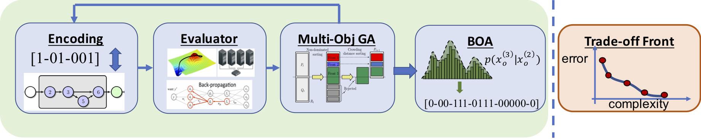

# uit-eas-nsganet
This project is inspired by the research paper titled "NSGA-Net: A Multi-Objective Genetic Algorithm for Neural Architecture Search". The primary objective of this project is to provide educational support in the field of evolutionary algorithms, specifically focusing on the application of NSGA-Net.

> [NSGA-Net: Neural Architecture Search using Multi-Objective Genetic Algorithm](https://arxiv.org/abs/1810.03522)
>
> Zhichao Lu, Ian Whalen, Vishnu Boddeti, Yashesh Dhebar, Kalyanmoy Deb, Erik Goodman and Wolfgang Banzhaf
>
> *arXiv:1810.03522*



## Project Description

This project is inspired by the research paper titled "NSGA-Net" (Author: [Author Name], DOI: [DOI]). The primary objective of this project is to provide educational support in the field of evolutionary algorithms, specifically focusing on the application of NSGA-Net.

### Background

The project is developed as part of the coursework in Evolutionary Algorithms, Computer Science discipline at the University of Information Technology, VNU-HCMC. This initiative aligns with the academic curriculum to deepen understanding and practical implementation of evolutionary algorithms in the context of machine learning.

### Purpose

The main goal of this project is to explore and implement NSGA-Net, a cutting-edge algorithm discussed in the referenced paper. By delving into this evolutionary approach, the project aims to facilitate a comprehensive learning experience for students studying computer science, particularly in the domain of evolutionary algorithms.

## Requirements
``` 
Python >= 3.6.8, PyTorch >= 1.0.1.post2, torchvision >= 0.2.2, pymoo == 0.3.0
```

## Architecture validation
To validate the results by training from scratch, run
``` 
# architecture found from macro search space
python validation/train.py --net_type macro --cutout --batch_size 128 --epochs 20 
# architecture found from micro search space
python validation/train.py --net_type micro --arch NSGANet --layers 20 --init_channels 34 --filter_increment 4  --cutout --auxiliary --batch_size 96 --droprate 0.2 --SE --epochs 20
```

## Architecture search 
To run architecture search:
``` shell
# macro search space
python search/evolution_search.py --search_space macro --init_channels 32 --n_gens 30
# micro search space
python search/evolution_search.py --search_space micro --init_channels 16 --layers 8 --epochs 20 --n_offspring 20 --n_gens 30
``` 

## Visualization
To visualize the architectures:
``` shell
python visualization/macro_visualize.py NSGANet            # macro search space architectures
python visualization/micro_visualize.py NSGANet            # micro search space architectures
```

## Citations
``` 
@article{nsganet,
  title={NSGA-NET: a multi-objective genetic algorithm for neural architecture search},
  author={Lu, Zhichao and Whalen, Ian and Boddeti, Vishnu and Dhebar, Yashesh and Deb, Kalyanmoy and Goodman, Erik and  Banzhaf, Wolfgang},
  booktitle={GECCO-2019},
  year={2018}
}
```

## Acknowledgement 
Code heavily inspired and modified from [pymoo](https://github.com/msu-coinlab/pymoo), [DARTS](https://github.com/quark0/darts#requirements), [pytorch-cifar10](https://github.com/kuangliu/pytorch-cifar) and [NSGA-Net] (https://github.com/ianwhale/nsga-net)


